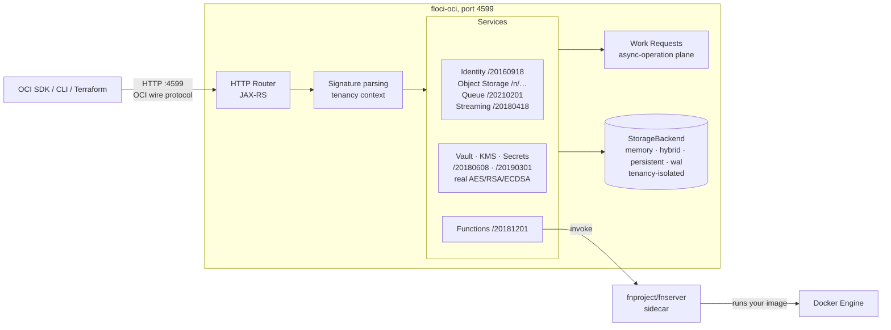

<p align="center">
  
  
</p>

<p align="center">
  <strong>Light, fluffy, and always free — now for Oracle Cloud</strong><br />
  No account. No API key ceremony. No feature gates. Just <code>docker compose up</code>.
</p>

<p align="center">
  <a href="https://github.com/floci-io/floci-oci/releases/latest"></a>
  <a href="https://github.com/floci-io/floci-oci/actions/workflows/ci.yml"></a>
  <a href="https://opensource.org/licenses/MIT"></a>
  <a href="https://github.com/floci-io/floci-oci/stargazers"></a>
</p>

<p align="center">
  <a href="#quick-start">Quick Start</a> ·
  <a href="#features">Features</a> ·
  <a href="#supported-services">Services</a> ·
  <a href="#sdk-integration">SDKs</a> ·
  <a href="#terraform-and-opentofu">Terraform</a> ·
  <a href="https://floci.io/floci-oci/">Docs</a>
</p>

---

## What is floci-oci?

floci-oci is a free, open-source local **Oracle Cloud Infrastructure (OCI)** emulator for development, testing, and CI.

It gives you OCI-shaped services on your machine without an Oracle Cloud account, uploaded API keys, or paid feature gates. Point the OCI SDKs, the OCI CLI, Terraform, or OpenTofu at `http://localhost:4599` and keep your existing workflows.

floci-oci is the OCI member of the [Floci](https://github.com/floci-io) emulator family — named after [floccus](https://en.wikipedia.org/wiki/Cirrocumulus_floccus), the cloud formation that looks like popcorn.

| Emulator | Cloud | Port |
|---|---|:---:|
| [floci](https://github.com/floci-io/floci) | AWS | 4566 |
| [floci-az](https://github.com/floci-io/floci-az) | Azure | 4577 |
| [floci-gcp](https://github.com/floci-io/floci-gcp) | GCP | 4588 |
| **floci-oci** | **OCI** | **4599** |

## Quick Start

Create a `compose.yaml` file:

```yaml
services:
  floci-oci:
    image: floci/floci-oci:latest
    ports:
      - "4599:4599"
```

Start floci-oci:

```bash
docker compose up
```

Use your existing OCI tools normally:

```bash
oci os ns get --endpoint http://localhost:4599

oci os bucket create --endpoint http://localhost:4599 \
  --compartment-id ocid1.tenancy.oc1..flocilocaltenancy0000000000000000000000000000000000000000 \
  --namespace floci-local --name my-bucket

oci iam compartment list --endpoint http://localhost:4599 \
  --compartment-id ocid1.tenancy.oc1..flocilocaltenancy0000000000000000000000000000000000000000
```

Any locally generated API key works — floci-oci parses the request signature for tenancy and user context but never verifies it. See [OCI CLI & SDK Setup](https://floci.io/floci-oci/getting-started/oci-setup/) for a one-time throwaway config.

<details>
<summary>Prefer building from source?</summary>

Requirements: JDK 25.

```bash
./mvnw quarkus:dev          # dev mode on port 4599
# or
./mvnw clean package -DskipTests
java -jar target/quarkus-app/quarkus-run.jar
```

Verify it is up:

```bash
curl http://localhost:4599/_floci-oci/health
```

</details>

<details>
<summary>Bundled CLI wrapper</summary>

`bin/ocilocal` injects the emulator endpoint into every OCI CLI call:

```bash
bin/ocilocal os ns get
bin/ocilocal iam region list
```

</details>

## Features

<details open>
<summary><strong>Local OCI without the cloud account</strong></summary>

Run OCI-compatible services locally without an Oracle Cloud account, uploaded API keys, or paid feature gates.

</details>

<details>
<summary><strong>Real OCI wire protocols</strong></summary>

Real request and response shapes: `opc-request-id` on every response, `opc-next-page` pagination headers, `etag` / `if-match` conditional requests, OCIDs, work requests for async operations, and OCI's exact error bodies (`NotAuthorizedOrNotFound`, `BucketNotFound`, …).

</details>

<details>
<summary><strong>Drop-in SDK, CLI, and IaC compatibility</strong></summary>

The official oci-java-sdk, Python SDK, OCI CLI, and the `oracle/oci` Terraform provider work unchanged — validated continuously by the [compatibility suite](#compatibility-testing).

</details>

<details>
<summary><strong>Fast enough for CI</strong></summary>

Built on Quarkus with GraalVM native-image support, so it starts fast and stays light in test pipelines.

</details>

<details>
<summary><strong>Configurable persistence</strong></summary>

Choose from in-memory, persistent, hybrid, and write-ahead log storage depending on the durability profile you need.

</details>

## Why floci-oci?

Oracle Cloud has no official local emulator — no LocalStack equivalent, no all-in-one dev container. Testing OCI integrations means a real tenancy, real credentials, and real network round-trips, even in CI.

floci-oci fills that gap the same way its siblings do for AWS, Azure, and GCP: one container, one port, real wire protocols, MIT licensed, free forever.

## Architecture Overview



## Supported Services

| Category | Services |
|---|---|
| Identity | Compartments, users, groups, user-group memberships, policies, availability domains, regions, region subscriptions, tenancies |
| Storage | Object Storage: namespaces, buckets, objects, listing, rename, copy, multipart uploads, pre-authenticated requests |
| Messaging | Queue (visibility timeouts, dead-letter queues, channels), Streaming (partitioned log, cursors, consumer groups) |
| Security | Vault + KMS (vaults, keys, key versions, **real** AES-GCM / RSA / ECDSA crypto), Secrets and secret bundles |
| Serverless | Functions (applications, functions, real invocation through an Fn Project sidecar) |
| Async operations | Work requests, partitioned per service (Identity/Queue/Streaming use `SUCCEEDED`, Object Storage uses `COMPLETED`) |

For operation-level compatibility, see the [Services Overview](https://floci.io/floci-oci/services/).

<details>
<summary>Detailed service notes</summary>

| Service | How it works | Notable features |
|---|---|---|
| Identity (IAM) | In-process | Compartment CRUD incl. `compartmentIdInSubtree` listing and async delete via work request; users, groups, memberships; policies (statements stored verbatim); reference data (3 ADs, regions, tenancy); etag concurrency on every mutation |
| Object Storage | In-process | Bucket CRUD (delete requires empty); objects with `Content-MD5` verification, `opc-meta-*` metadata, Range/206 reads, conditional headers; ListObjects with `prefix`/`start`/`end`/`delimiter`/`fields` and `nextStartWith` truncation; rename; async copy via work request; multipart uploads (per-part `etag` + `opc-content-md5`); pre-authenticated requests with anonymous `/p/{token}/…` data path |
| Queue | In-process | Work-request-driven control plane (mutations return no body); data plane with visibility timeouts, `0`-visibility peeks, long polling, dead-letter queues, per-channel filtering, stats; wrapped `{"items":[…]}` list shape |
| Streaming | In-process | Partitioned append-only log with key-hash placement; opaque cursors (`TRIM_HORIZON`/`LATEST`/`AT_OFFSET`/`AFTER_OFFSET`/`AT_TIME`), group cursors with commit + resume, `opc-next-cursor` paging; CreateStream returns body *and* work request |
| Vault + KMS | In-process, real crypto | Vaults and keys with schedule/cancel deletion (no DELETE verb), key rotation; AES-GCM encrypt/decrypt whose envelope survives rotation, RSA/ECDSA sign/verify via JCA, CRC32 `plaintextChecksum` |
| Secrets | In-process | Secret versions with CURRENT/PREVIOUS/LATEST stages; the `Secret` shape never echoes content — retrieval is through `/20190301/secretbundles`, including the bodyless POST `getByName` |
| Functions | Real Docker (Fn Project) | Applications and functions with deterministic image digests; invocation proxied to a shared `fnproject/fnserver` sidecar that runs your real FDK image. `mock: true` disables Docker entirely |
| Work Requests | In-process | `202` + `opc-work-request-id` responses, pollable per service (`/20160918`, `/20210201`, `/20180418` and unversioned `/workRequests`) with errors/logs endpoints |

Not implemented yet: identity domains, API keys/auth tokens, dynamic groups, tag namespaces, object versioning, retention rules (stubbed empty for Terraform compatibility), lifecycle policies, replication, the Amazon S3 Compatibility API, queue consumer groups, stream pools' Kafka settings and connect harnesses, KMS import/backup/replication, secret rotation, and pre-built functions (PBF).

</details>

## Real Docker Integration

floci-oci runs a real container where in-process emulation would not be faithful.

| Service | Default image | What is real |
|---|---|---|
| Functions | `fnproject/fnserver:latest` | The open-source engine OCI Functions is built on. Your function image runs for real — fnserver spawns it as a sibling container and speaks the FDK http-stream contract |

Docker-backed services need the Docker socket:

```bash
docker run -d --name floci-oci \
  -p 4599:4599 \
  -v /var/run/docker.sock:/var/run/docker.sock \
  floci/floci-oci:latest
```

Set `FLOCI_OCI_SERVICES_FUNCTIONS_MOCK=true` to skip Docker entirely — the management
plane stays fully usable and invocations return a synthetic body. That is the default in
the test suite, so `./mvnw test` never needs a Docker daemon.

`services/functions/` is also the **reference implementation** for contributing a
sidecar-backed service; see the "Services with Container Sidecars" section of
[AGENTS.md](AGENTS.md).

## Persistence and Storage Modes

floci-oci can trade speed for durability depending on the workflow. Configure the default mode with `FLOCI_OCI_STORAGE_MODE`, or override storage per service.

| Mode | Behavior | Best for | Durability |
|---|---|---|:---:|
| `memory` | Entirely in RAM. Data is lost when the container stops. | CI and ephemeral tests | None |
| `persistent` | Loaded at startup and flushed to disk immediately on every write operation. | Simple local state preservation with immediate persistence | Medium |
| `hybrid` | In-memory performance with periodic async flushing every 5 seconds. | Local development | Good |
| `wal` | Write-ahead log. Every mutation is logged before responding. | Maximum durability | Highest |

Per-service overrides use the map form: `FLOCI_OCI_STORAGE_SERVICES_OBJECTSTORAGE_MODE=wal`.

For more detail, see the [Storage Configuration documentation](https://floci.io/floci-oci/configuration/storage/).

## Multi-Tenancy Isolation

floci-oci supports per-tenancy resource isolation with no extra setup. The tenancy OCID in your signing key's `keyId` is the storage partition — requests signed with different tenancy OCIDs see fully isolated resources.

```bash
# Two profiles with different tenancy OCIDs see independent worlds
oci --profile TENANCY_A iam user list --endpoint http://localhost:4599
oci --profile TENANCY_B iam user list --endpoint http://localhost:4599
```

Unsigned requests fall back to `FLOCI_OCI_DEFAULT_TENANCY_ID`. Compartments are a field on each resource (filtered via `compartmentId`), exactly as on real OCI — tenancy is the isolation boundary, compartments are the organizational one.

## SDK Integration

Point your existing OCI SDK at `http://localhost:4599`. Any locally generated RSA key works — the signature is parsed for tenancy/user context, never verified.

<details>
<summary><strong>Java, oci-java-sdk</strong></summary>

```java
KeyPair pair = KeyPairGenerator.getInstance("RSA").generateKeyPair();
var auth = SimpleAuthenticationDetailsProvider.builder()
        .tenantId("ocid1.tenancy.oc1..flocilocaltenancy0000000000000000000000000000000000000000")
        .userId("ocid1.user.oc1..anyuser")
        .fingerprint("aa:bb:cc:dd:ee:ff:00:11:22:33:44:55:66:77:88:99")
        .privateKeySupplier(() -> new ByteArrayInputStream(pemOf(pair)))
        .region(Region.US_ASHBURN_1)
        .build();

ObjectStorageClient client = ObjectStorageClient.builder().build(auth);
client.setEndpoint("http://localhost:4599");

String namespace = client.getNamespace(GetNamespaceRequest.builder().build()).getValue();
client.createBucket(CreateBucketRequest.builder()
        .namespaceName(namespace)
        .createBucketDetails(CreateBucketDetails.builder()
                .name("my-bucket")
                .compartmentId(auth.getTenantId())
                .build())
        .build());
```

</details>

<details>
<summary><strong>Python, oci</strong></summary>

```python
import oci

config = {
    "user": "ocid1.user.oc1..anyuser",
    "fingerprint": "aa:bb:cc:dd:ee:ff:00:11:22:33:44:55:66:77:88:99",
    "tenancy": "ocid1.tenancy.oc1..flocilocaltenancy0000000000000000000000000000000000000000",
    "region": "us-ashburn-1",
    "key_file": "~/.oci/floci_key.pem",   # any locally generated key
}

client = oci.object_storage.ObjectStorageClient(
    config, service_endpoint="http://localhost:4599")

namespace = client.get_namespace().data
client.put_object(namespace, "my-bucket", "hello.txt", b"hello from floci-oci")
print(client.get_object(namespace, "my-bucket", "hello.txt").data.content)
```

</details>

<details>
<summary><strong>Bash, OCI CLI</strong></summary>

```bash
# One-time throwaway profile
mkdir -p ~/.oci && openssl genrsa -out ~/.oci/floci_key.pem 2048
cat >> ~/.oci/config <<'EOF'
[FLOCI]
user=ocid1.user.oc1..flocilocaluser0000000000000000000000000000000000000000000000
fingerprint=aa:bb:cc:dd:ee:ff:00:11:22:33:44:55:66:77:88:99
tenancy=ocid1.tenancy.oc1..flocilocaltenancy0000000000000000000000000000000000000000
region=us-ashburn-1
key_file=~/.oci/floci_key.pem
EOF

oci --profile FLOCI os ns get --endpoint http://localhost:4599
```

</details>

## Terraform and OpenTofu

The official `oracle/oci` provider works against floci-oci through its per-client host overrides — no provider fork, no wrapper:

```bash
export TF_VAR_CLIENT_HOST_OVERRIDES="oci_identity.IdentityClient=http://localhost:4599;oci_object_storage.ObjectStorageClient=http://localhost:4599"
```

```hcl
provider "oci" {
  tenancy_ocid     = "ocid1.tenancy.oc1..flocilocaltenancy0000000000000000000000000000000000000000"
  user_ocid        = "ocid1.user.oc1..anyuser"
  fingerprint      = "aa:bb:cc:dd:ee:ff:00:11:22:33:44:55:66:77:88:99"
  private_key_path = "./any_local_key.pem"
  region           = "us-ashburn-1"
}

resource "oci_objectstorage_bucket" "demo" {
  compartment_id = "ocid1.tenancy.oc1..flocilocaltenancy0000000000000000000000000000000000000000"
  namespace      = "floci-local"
  name           = "demo-bucket"
}
```

The full apply → plan (zero drift) → destroy cycle is validated in CI for both Terraform and OpenTofu. See [`compatibility-tests/compat-terraform`](./compatibility-tests/compat-terraform/) for a working example.

## Compatibility Testing

The [`compatibility-tests`](./compatibility-tests/) directory validates floci-oci with real SDKs and IaC tooling — not just theoretical protocol adherence.

| Module | Language / Tool | SDK / Client | Tests |
|---|---|---|---:|
| `sdk-test-java` | Java | oci-java-sdk | 18 |
| `sdk-test-python` | Python 3 | oci (incl. `UploadManager` streaming) | 20 |
| `compat-terraform` | Terraform | oracle/oci provider (11 resources, zero-drift plan) | 6 |
| `compat-opentofu` | OpenTofu | oracle/oci provider (11 resources, zero-drift plan) | 6 |

Run everything in Docker against a compose-built emulator:

```bash
make compat-docker
```

Or a single suite against a locally running emulator: `make test-java-compat`, `make test-python-compat`, `make test-terraform-compat`, `make test-opentofu-compat`.

## Image Tags

Every tag combines a variant and a channel.

| Channel | Tag |
|---|---|
| Release, floating | `latest` |
| Release, pinned | `x.y.z` |
| Nightly, floating | `nightly` |
| Nightly, dated | `nightly-mmddyyyy` |

```yaml
# Recommended
image: floci/floci-oci:latest

# Pinned release
image: floci/floci-oci:0.1.0

# Track main
image: floci/floci-oci:nightly
```

## Configuration

All settings are overridable through environment variables with the `FLOCI_OCI_` prefix.

| Variable | Default | Description |
|---|---|---|
| `FLOCI_OCI_PORT` | `4599` | Port exposed by the floci-oci API |
| `FLOCI_OCI_DEFAULT_REGION` | `us-ashburn-1` | Region used in OCIDs and reference data |
| `FLOCI_OCI_DEFAULT_REALM` | `oc1` | Realm key used when minting OCIDs |
| `FLOCI_OCI_DEFAULT_TENANCY_ID` | `ocid1.tenancy.oc1..flocilocal…` | Tenancy used for unsigned requests |
| `FLOCI_OCI_DEFAULT_NAMESPACE` | `floci-local` | Object Storage namespace |
| `FLOCI_OCI_BASE_URL` | `http://localhost:4599` | Base URL used when floci-oci returns service URLs |
| `FLOCI_OCI_HOSTNAME` | Unset | Hostname used in returned URLs when floci-oci runs inside Docker Compose |
| `FLOCI_OCI_STORAGE_MODE` | `memory` | Storage mode: `memory`, `persistent`, `hybrid`, or `wal` |
| `FLOCI_OCI_STORAGE_PERSISTENT_PATH` | `./data` | Directory used for persisted state |
| `FLOCI_OCI_AUTH_REQUIRE_SIGNATURE` | `false` | Reject unsigned requests with 401 `NotAuthenticated` |
| `FLOCI_OCI_TLS_ENABLED` | `false` | Serve HTTPS + HTTP on the same port |

Full reference: [configuration docs](https://floci.io/floci-oci/configuration/environment-variables/)

### Multi-container Docker Compose

When your application runs in a different container, set `FLOCI_OCI_HOSTNAME` to the floci-oci service name so returned URLs resolve correctly.

```yaml
services:
  floci-oci:
    image: floci/floci-oci:latest
    ports:
      - "4599:4599"
    environment:
      - FLOCI_OCI_HOSTNAME=floci-oci

  my-app:
    environment:
      - OCI_ENDPOINT=http://floci-oci:4599
    depends_on:
      - floci-oci
```

## Community

Join the Floci community on [Slack](https://join.slack.com/t/floci/shared_invite/zt-3tjn02s3q-A00kEjJ1cZxsg_imTfy6Cw) or [GitHub Discussions](https://github.com/orgs/floci-io/discussions). Feature ideas, compatibility questions, design tradeoffs, and rough proposals are welcome.

## Sponsors

Floci is independent open source, funded by its users. If floci-oci saves you time,
consider [sponsoring the project](https://github.com/sponsors/floci-io) — every
tier keeps the emulators fast, light, and free.

## Star History

<p align="center">
  <a href="https://www.star-history.com/?repos=floci-io%2Ffloci-oci&type=date&legend=top-left">
    <picture>
      <source media="(prefers-color-scheme: dark)" srcset="https://api.star-history.com/chart?repos=floci-io/floci-oci&type=date&theme=dark&legend=top-left" />
      <source media="(prefers-color-scheme: light)" srcset="https://api.star-history.com/chart?repos=floci-io/floci-oci&type=date&legend=top-left" />
      
    </picture>
  </a>
</p>

## Contributors

<a href="https://github.com/floci-io/floci-oci/graphs/contributors">
  
</a>

## License

MIT. Use it however you want.
